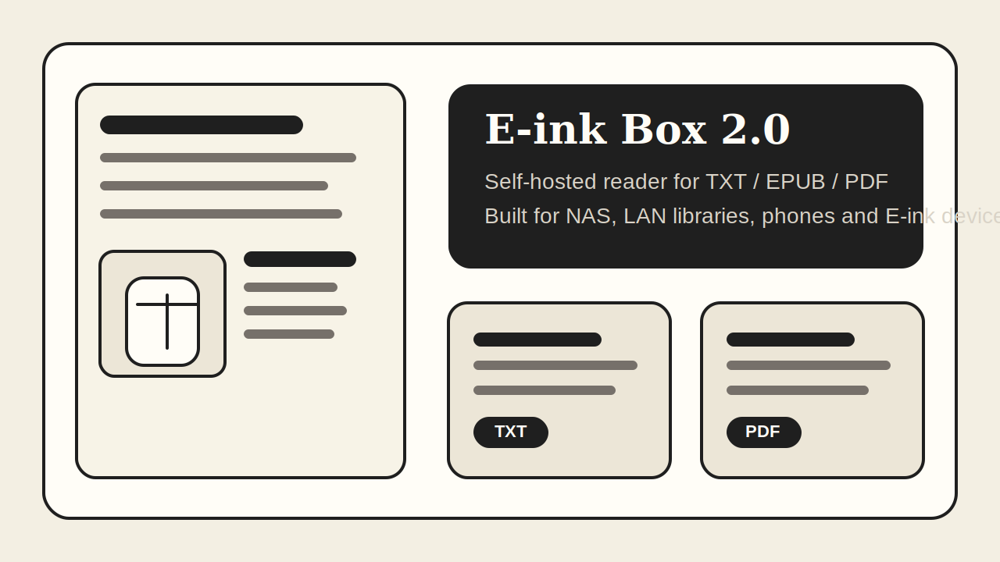

# E-ink Box 2.0



[](#)
[](https://github.com/leduchuong/eink_reader/stargazers)
[](https://github.com/leduchuong/eink_reader/network/members)
[](https://github.com/leduchuong/eink_reader/issues)
[](https://github.com/leduchuong/eink_reader/blob/main/LICENSE)
[](#)
[](#)

[English](README_en.md)

> Better alternative to EinkBro for E-ink devices.

面向 NAS、自建书库和墨水屏设备的轻量局域网阅读器，支持 TXT、EPUB、PDF 在线阅读、最近阅读与跨设备进度同步。

## Why this tool?（为什么要做它）

如果你在手机、NAS 和墨水屏之间来回折腾书库，往往会遇到格式支持不一致、TXT 只能滚动不能分页、PDF 在浏览器里体验割裂、换设备后进度丢失这些问题。E-ink Box 2.0 的目标就是把这些零散又别扭的阅读环节收拢成一个轻量、自托管、适合局域网长期使用的统一阅读入口。

## 为什么有用（痛点）

- 墨水屏和移动浏览器对网页阅读器兼容性不稳定，普通页面往往点几下就出现交互冲突或底部遮挡。
- TXT 小说常见的“长页滚动”不适合专注阅读，无法稳定分页、跳页，也缺少目录感。
- 同一本书换设备后经常找不到上次位置，WebDAV 书库也常常只有浏览能力，没有顺畅阅读和历史同步能力。

## 项目做什么（功能概览）

- 支持 TXT / EPUB / PDF 三种核心格式在线阅读，PDF 通过 PDF.js 页面内渲染，EPUB 采用更稳定的二进制加载方式。
- TXT 阅读器支持真分页、上一页/下一页/跳页、标题识别、目录生成与章节分页保护，更接近电子书阅读体验。
- 提供最近阅读、服务端阅读历史、跨设备进度写回、WebDAV 来源管理、文件删除入口与缓存预热优化。

## ⚡️ Quick Start (Run in 3 seconds)

```bash
docker run -d --name eink-reader --restart unless-stopped -p 2004:8000 -e STORAGE_PATH=/storage -v /path/to/your/books:/storage ghcr.io/leduchuong/eink_reader:latest
```

> 默认 Web UI 监听宿主机 `2004` 端口，容器内部服务端口为 `8000`。

## Docker Compose（Portainer / NAS 可直接粘贴）

```yaml
services:
  app:
    image: ghcr.io/leduchuong/eink_reader:latest
    container_name: eink-reader
    restart: unless-stopped
    environment:
      - TZ=Asia/Shanghai
      - STORAGE_PATH=/storage
    ports:
      - "2004:8000"
    volumes:
      - /path/to/your/books:/storage
```

这个配置可以直接粘贴到 Portainer 或 NAS 面板里使用。

## GitHub Topics（建议至少 5 个）

`#nas` `#homelab` `#selfhosted` `#synology` `#unraid` `#eink` `#automation`

## 📈 可视化指标（Profile 风格）

<p align="left">  </p>

<p>
  
  
</p>

<p></p>

<picture>
  <source media="(prefers-color-scheme: dark)" srcset="https://api.star-history.com/svg?repos=leduchuong/eink_reader&type=Date&theme=dark" />
  <source media="(prefers-color-scheme: light)" srcset="https://api.star-history.com/svg?repos=leduchuong/eink_reader&type=Date" />
  
</picture>

## 🧰 Languages and Tools

<p align="left"></p>

## 如何快速开始（Getting Started）

### 环境要求

- Docker / Docker Compose，或 Python 3.12 本地运行环境。
- 需要一个可读写的书库存储目录，并通过 `STORAGE_PATH` 挂载到容器内。

### 安装

```bash
git clone https://github.com/leduchuong/eink_reader.git
cd eink_reader
python -m venv .venv
source .venv/bin/activate
pip install -r requirements.txt
```

### 运行

```bash
STORAGE_PATH=/storage uvicorn app.main:app --host 0.0.0.0 --port 8000 --reload
```

## 使用示例

```bash
docker compose up -d --build
```

打开 `http://localhost:2004` 后即可浏览本地书库、配置 WebDAV 来源并继续最近阅读。

## 在哪里获得帮助

- Issue: https://github.com/leduchuong/eink_reader/issues
- Discussion: https://github.com/leduchuong/eink_reader/discussions
- 如果你在墨水屏浏览器、EinkBro 或移动端遇到兼容性问题，建议附上设备型号、浏览器内核和复现步骤。

## 维护者与贡献者

- Maintainer: @leduchuong
- Contributing: [CONTRIBUTING.md](CONTRIBUTING.md)

## 2.0 版本亮点

- 阅读格式能力增强：支持 TXT / EPUB / PDF 在线阅读，PDF 改为 PDF.js 页面内阅读，EPUB 改为更稳定的二进制加载。
- TXT 阅读器升级：支持真分页、上一页 / 下一页 / 跳页、原始分段优先、标题识别、标题分页保护、TXT 目录与跳页。
- 阅读器交互优化：模式切换改为弹窗选择，书架页与阅读页交互统一，底栏 / 设置 / 目录状态拆分，移动端安全区适配更好。
- 历史记录与同步增强：新增服务端阅读历史、首页最近阅读、TXT / PDF / EPUB 进度写回、单项清除与全部清除。
- 书架与来源管理增强：支持 WebDAV 测试连接、最近阅读入口、目录和文件直接删除、WebDAV 缓存与预热优化。

## 项目结构

- 后端：`app/main.py`
- 书架页：`static/index.html`
- 阅读页：`static/read.html`
- 书架逻辑：`static/js/main.js`
- 阅读逻辑：`static/js/reader.js`
- 样式：`static/css/eink.css`

## 🤝 Connect

- GitHub: https://github.com/leduchuong
- Repository: https://github.com/leduchuong/eink_reader

## 免责声明

使用本项目即表示你已阅读并同意 [免责声明](DISCLAIMER.md)。

## 许可证

MIT，详见 [LICENSE](LICENSE)
